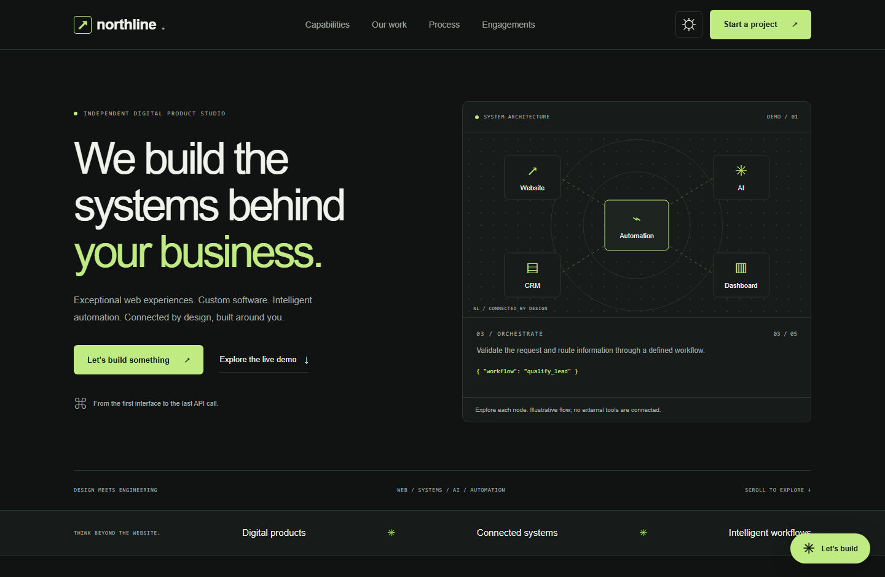
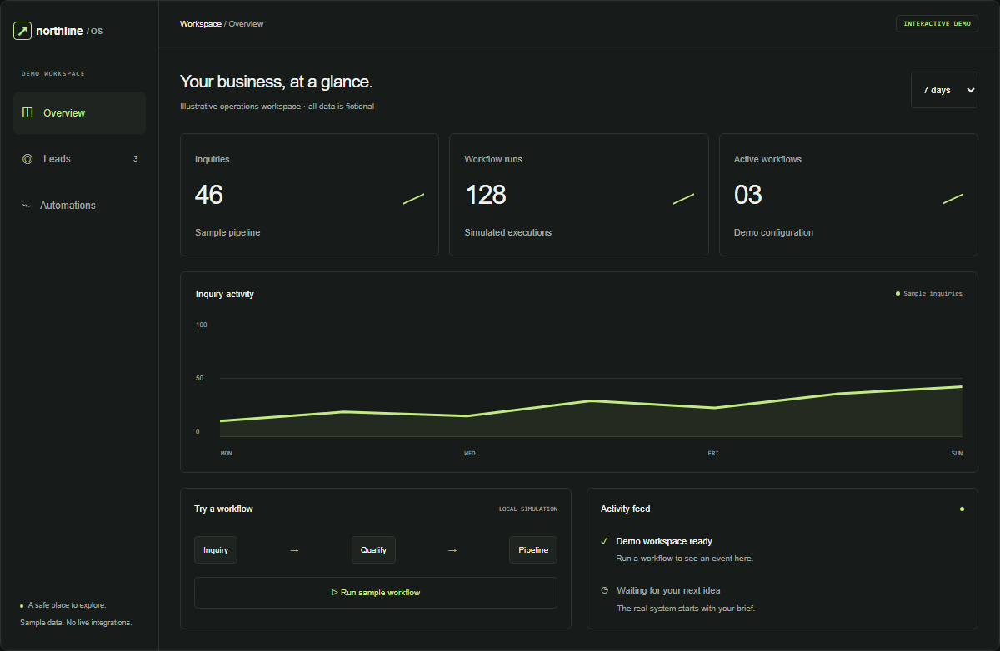
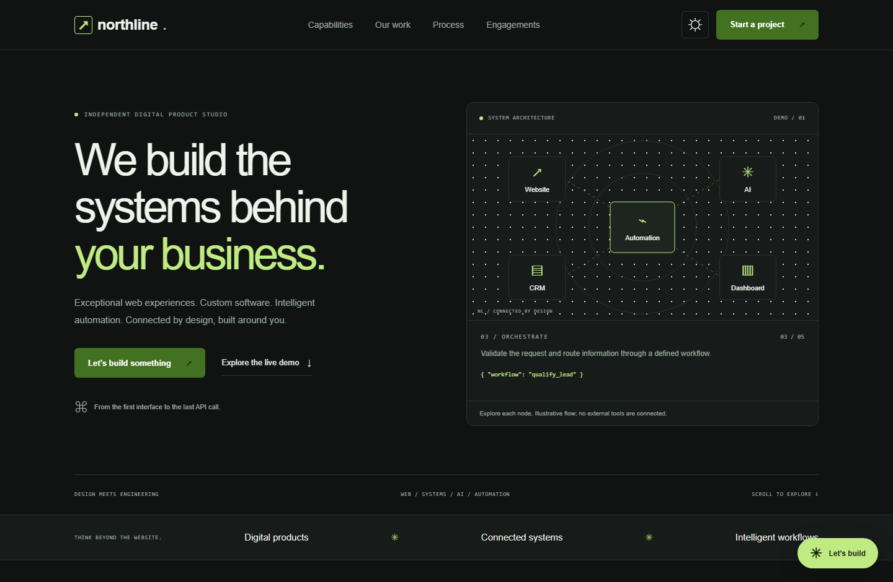
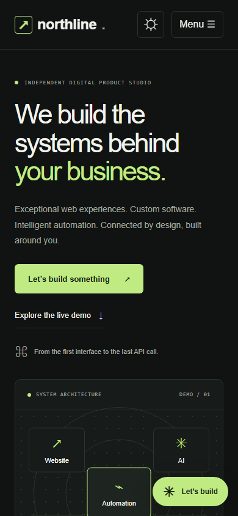
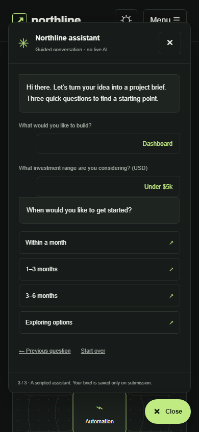

<div align="center">

# Northline Studio

### We build the systems behind your business.

A digital product studio portfolio exploring web applications, custom systems, and intelligent automation.

**Next.js · React · TypeScript · Tailwind CSS · PostgreSQL · Prisma**

[Preview](#preview) · [Features](#features) · [Architecture](#architecture) · [Run locally](#local-setup) · [Verification](docs/PORTFOLIO_VALIDATION.md)

</div>



## About the project

Northline brings the agency's capabilities into the interface itself: an explorable system map, an interactive operations dashboard, and a guided project assistant. The existing Next.js application and PostgreSQL-backed contact API power a more complete product experience.

This is a portfolio project. Concept work and sample data are labelled throughout; no client endorsements, business outcomes, or live CRM integrations are implied.

## Features

| Experience | What you can do |
| --- | --- |
| **Connected system map** | Explore Website → AI → Automation → CRM → Dashboard through keyboard-operable nodes. |
| **Operations dashboard** | Switch views and reporting periods, search fictional leads, toggle a workflow, and run a local simulation. |
| **Project assistant** | Choose a project type, budget, and timeline, then review and submit a brief. The conversation is scripted; no AI API is required. |
| **Qualified inquiries** | Submit company and project context through the existing validated API. Failed submissions preserve the input. |
| **Dark and light themes** | Switch themes with a persisted preference and dark mode as the default. |
| **Responsive interface** | Explore desktop and mobile layouts with visible focus states, reduced-motion support, and accessible form feedback. |

## Preview

Screenshots below are captured from the running application. Dashboard figures and assistant choices are demonstration data.

### Operations dashboard



<details>
<summary><strong>View the light theme</strong></summary>



</details>

### Mobile and guided assistant

<table>
  <tr>
    <td align="center"><strong>Mobile homepage</strong></td>
    <td align="center"><strong>Project qualification</strong></td>
  </tr>
  <tr>
    <td align="center"></td>
    <td align="center"></td>
  </tr>
</table>

## Architecture

| Layer | Implementation |
| --- | --- |
| Application | Next.js 14 App Router with server-rendered pages and focused client components |
| Interface | React 18, TypeScript, Tailwind CSS, CSS theme tokens and local SVG artwork |
| Client state | Zustand for navigation; TanStack Query for inquiry mutations |
| Backend | Next.js route handler at POST /api/contact |
| Validation | Shared input normalization, length checks and qualification allowlists |
| Persistence | Prisma 6 with PostgreSQL and additive migrations |
| Testing | Vitest and React Testing Library; production-browser layout and interaction checks |

```text
app/                  Pages, layouts, styles, metadata, contact API
components/           Sections, interactive demos, assistant, inquiry form
lib/                  Shared validation, options, state, database client
prisma/               Database schema and versioned migrations
public/images/        Original concept illustrations
tests/                UI, qualification, and API tests
docs/                 Verification notes and screenshot gallery
```

### How a brief reaches the database

```text
Inquiry form / guided assistant
              ↓
Shared client validation
              ↓
POST /api/contact
  Origin + content-type + size checks
  Server validation + honeypot
              ↓
Prisma → PostgreSQL ContactSubmission
              ↓
Success only after a completed write*
```

*Honeypot submissions intentionally receive an indistinguishable response without being stored.*

The assistant only sends information after explicit form submission. The dashboard and system map do not trigger external actions. There are no email, WhatsApp, or CRM automations configured.

## Verification snapshot

- **27 tests passed** across five test files.
- **TypeScript passed** without errors.
- **Production build passed** using an isolated output directory to avoid a OneDrive cache-cleanup issue.
- **32 route/viewport checks:** eight page routes at 320, 390, 768, and 1440 px, with no horizontal overflow or browser console errors.
- **Database limitation:** API tests mock Prisma. The configured PostgreSQL server was unavailable, so live persistence and migration execution remain unverified.

See [the verification record](docs/PORTFOLIO_VALIDATION.md) for scope and limitations. These are recorded checks, not a live CI badge or a claim of production deployment.

## Release status

The source is ready for setup and testing, but public production release is blocked by the required Next.js 14 line: npm audit reports a critical advisory for Next.js 14.2.35, the newest published 14.x version at verification. Next.js 14 is outside current LTS support. Upgrade to a supported, patched major before public deployment; this revision retains the existing framework major; the visual and inquiry upgrades do not resolve this release blocker. See https://nextjs.org/support-policy and https://github.com/vercel/next.js/security/advisories. Other reported dependency findings were resolved using compatible versions and a PostCSS override. The remaining risk is not claimed to be fixed by application-level safeguards.

## Local setup

Requires Node.js 22 LTS, npm, and PostgreSQL.

```sh
npm ci
cp .env.example .env
# PowerShell: Copy-Item .env.example .env
```

Set DATABASE_URL and DIRECT_URL to your PostgreSQL instance. The first is the runtime URL (a pooled connection is appropriate for serverless); the second is the direct migration URL. They may be identical locally. Use the database provider's TLS settings in production. Never commit credentials.

```sh
npm run db:deploy
npm run dev -- --hostname 127.0.0.1
```

Visit http://localhost:3000. The initial migration creates ContactSubmission; the additive 20261003000000_qualify_inquiries migration adds company, projectType, budget, timeline, and source without deleting existing records. No seed is needed. For subsequent schema changes, run `npm run db:migrate -- --name describe_change` and commit the generated migration. `npm run db:generate` regenerates Prisma Client.

## Configuration

| Variable | Use |
| --- | --- |
| DATABASE_URL | Runtime PostgreSQL URL |
| DIRECT_URL | Direct connection for migrations |
| NEXT_PUBLIC_SITE_URL | Canonical origin, without trailing slash |
| NEXT_PUBLIC_CONTACT_EMAIL | Your real public email; default hello@example.com is a placeholder |
| NEXT_PUBLIC_CALENDLY_URL | Your real HTTPS Calendly URL; empty uses email scheduling |
| NEXT_PUBLIC_LINKEDIN_URL | Your real agency profile; empty hides the link |
| NEXT_PUBLIC_GITHUB_URL | Your real agency profile; empty hides the link |

Public variables are embedded at build time; rebuild after changes. Never use NEXT_PUBLIC variables for secrets. Booking and social values should be valid HTTPS URLs.

## Verification and production server

```sh
npm test
npm run build
npm run typecheck
npm start -- --hostname 127.0.0.1
```

The build generates Prisma Client but does not connect to PostgreSQL or apply migrations. Tests cover the hero, successful and failed contact submissions, validation, persistence calls, safe database failures, origin checks, honeypot handling, and payload limits. API tests mock Prisma; real database persistence must be checked against your configured database.

## Contact flow

POST /api/contact accepts name, email, message, optional phone/company/projectType/budget/timeline, source (inquiry or chatbot), and the hidden website honeypot. Qualification choices are allowlisted and shared by both UIs; legacy submissions without these fields remain compatible. Input is trimmed and validated, request size is capped at 24 KB, browser origin is checked, and valid records are persisted with Prisma. Database failures return a safe 503 response without internal details. The form uses TanStack Query useMutation with pending, success and accessible error states, retaining input on failure. An explicit success response follows a completed database write, except intentionally indistinguishable bot responses.

Submissions are stored only: no email notification or CRM service is configured. Use `npx prisma studio` on a trusted local machine to review records; do not expose it publicly. Configure access control, backups and retention/deletion for the database.

Honeypot and origin checks do not constitute rate limiting. Configure a Vercel Firewall rate-limit rule on /api/contact for the expected traffic before public release. No extra backend service is included.

## Vercel deployment

1. Resolve the framework release blocker above before exposing the site publicly.
2. Push this folder as your repository root, or set it as Vercel's project root. Select Next.js and Node.js 22.x. vercel.json uses npm ci and npm run build.
3. Add the environment variables listed above. Set the real canonical domain and contact information. Use separate databases for Preview and Production.
4. From a trusted local shell or release job with the target database environment, run `npm run db:deploy`. Migrations are deliberately separate from builds so preview deployments do not modify production.
5. Deploy, attach the domain, configure the endpoint rate limit, and submit a real inquiry. Verify the row in the intended database and test booking, email, social links, and mobile navigation.

## Content to replace before launch

- Northline is an invented agency brand. Change header/footer, site configuration and metadata if needed.
- Portfolio SVGs are original illustrative concepts, clearly marked as placeholders; no real client projects or outcomes are claimed.
- The homepage has no testimonials. The preserved /testimonials route explains the portfolio evidence rather than inventing endorsements.
- Set real email, Calendly and social links; missing URLs never link to fabricated profiles.
- Confirm the service-plan scope and commercial terms. Pricing uses tailored quotes rather than invented amounts.
- Finalize the privacy template with the legal entity, retention period, processing basis, service providers and applicable rights.
- Verify migrations, database backups and access, canonical URL, and a real contact submission.

## Architecture and verification notes

Server-rendered pages and reusable sections remain in App Router. Client boundaries are limited to navigation/theme, interactive demos, and forms. The Zustand menu and TanStack Query provider are preserved. Client and API validation share the same qualification options in lib/inquiry.ts. Prisma remains a server-only dependency.

Run npm test, npm run typecheck, and npm run build. Vitest uses its runner config loader to avoid esbuild config-bundling permission failures in restricted Windows/OneDrive workspaces. If OneDrive locks generated files or Next.js reports EINVAL/readlink while clearing .next, use a fresh ignored output directory: set NORTHLINE_BUILD_DIR=.tools/build-check before both npm run build and npm start (PowerShell: $env:NORTHLINE_BUILD_DIR=".tools/build-check"). This only changes generated output; it does not copy or replace the project. Browser review was performed against the production server; curated screenshots are versioned in docs/images/, while raw QA captures remain ignored in test-results/.

The configured local PostgreSQL server was unavailable during this revision (P1001 at localhost:5432). The migration was created and Prisma Client generated, but live persistence and migration execution could not be verified. Start/configure PostgreSQL and run npm run db:deploy before using lead capture. No database changes were applied by this revision.


## Implementation notes

The theme preference is stored locally; assistant drafts remain in page memory while minimized and clear on reload. The schema adds company, projectType, budget, timeline, and source without removing existing records. No runtime dependency was added for the redesign.

Original portfolio illustrations remain explicitly labelled as concept work. The preserved secondary routes share the same reusable sections and visual system.
